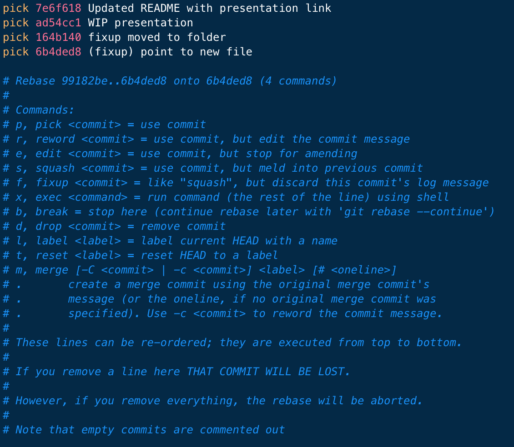

# Creating Great PRs
## Philippe Casgrain
### Senior Staff Software Developer, LightspeedHQ

Pull Requests (PRs) are one of the fundamental building blocks of software development. In this Tech Talk, we'll go over elements of great PRs and show you how to improve your own PRs by demystifying interactive rebases and staging changes.

---

## Agenda

* Elements of a great PR
* Help yourself with the right tools
* `git rebase --interactive`, the multi-tool of the `git` world
* Re-arranging a problematic PR
* Merging a good PR

---

# First things first

Remember that a PR is a _conversation_. It is about getting feedback from your peers, and discussing that feedback. 

You don't have to do everything that the reviewer says, in fact sometimes the reviewer is just looking for an answer to see if you've thought about something.

---

# Guiding principles

* A PR is a collection of one or more commits
* Each commit should be as small as it can be, but no smaller
  * Individual unit of change
  * Should not break the build by itself (`git bisect`)
* Each commit message should be associated with a Jira ticket
  * Subject line is short
  * Details in the commit message
  
---

# Your best foot forward

When creating a PR, you are telling the world "I think this is as good a solution as I can create for this issue".

Make sure that when you add reviewers, all the commits are ready to review:

* No missing code
* No "Work in progress"
* CI shows a green build

(Yes, Draft PRs are possible but out-of-scope for this presentation.)

---

# The right tools

* Git Tower
* Sourcetree (if you must)
* Terminal.app
* Text editor with a command-line interface
  * `echo "EDITOR='mate -w'; export EDITOR" >> ~/.zshrc`
  * `bbedit`, `xed`, `code`, `subl`, etc...

---

# `git rebase --interactive`

The Swiss Army Chainsaw in your toolkit

<!-- Here we quickly go over a UI that only a parent could love -->

---

